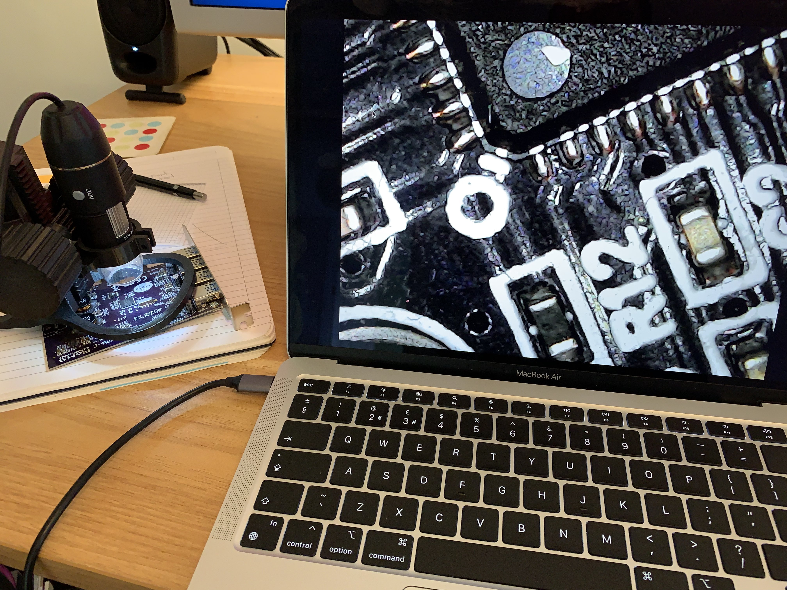

# microscope.app

Dead simple macOS app for viewing a USB microscope. Aimed at children. No frills.

## Instructions:

1. Connect a USB microscope.
2. Launch app.
3. Make window fullscreen.
4. Science!

Note: Note the app uses the first available camera capture device.
